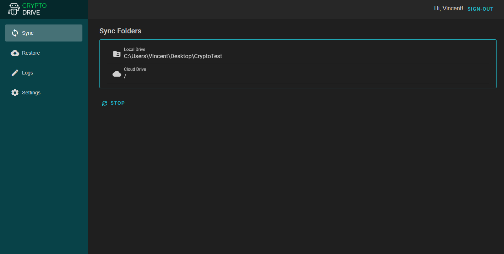
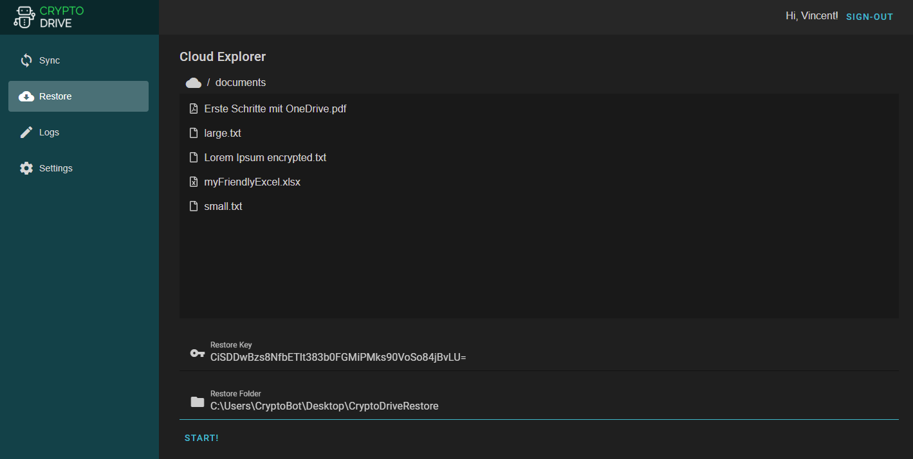
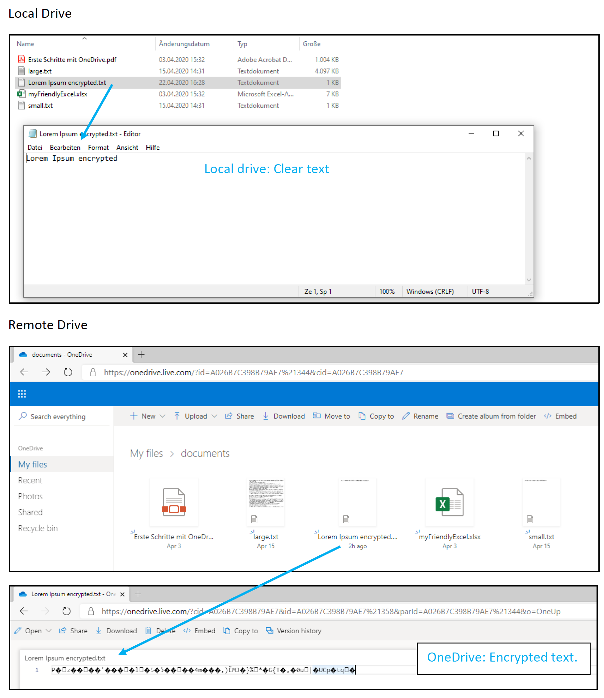

Backup your data safely without the need to trust the storage provider.

#### Done
- Select a sync folder pair: CryptoDrive uploads and encrypts the content of the local folder to OneDrive.
- Modify content of the local folder: CryptoDrive detects these changes and uploads them after a few seconds.
- Lost you local data? Go to "Restore" tab, enter your previously saved encryption key, select a source and target folder and let CryptoDrive restore (and decrypt) your data to your local drive.

#### Todo
- Bug fixing and error handling (e.g. no internet connection and syncing individual items failed)
- Progress visualization
- Linux tests
- Create installers (.msi / .deb)
- Add other storage providers
- Translation
- Add file / folder filters

### Sync

### Restore

